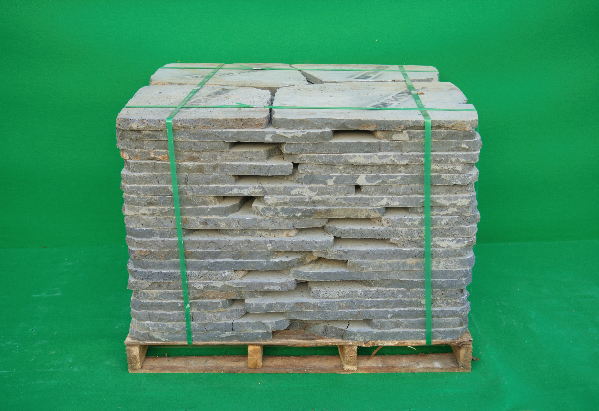

### 소개

- 천연 현무암 디딤석으로 주로 정원 바닥에 많이 쓰이는 제품입니다.
- 천연석 형태를 그대로 간직하여 자연스러운 게 특징입니다.
- 천연석 특성 상 사이즈는 각각 랜덤입니다.
- 두께에 따라 30T, 50T로 나뉩니다.

### 현무암 디딤석 부정형 50T

- 제품명 : 현무암 디딤석 부정형 50T
- 사이즈 : 두께 50mm 가로세로 400~600mm
- 1파레트당 : 52장
- 무게 : 1.2톤 (1파레트)
- 시공면적 : 약 3평

### 현무암 디딤석 부정형 50T

- 제품명 : 현무암 디딤석 부정형 30T
- 사이즈 : 두께 30mm 가로세로 400~600mm
- 1파레트당 : 84장
- 무게 : 1.2톤 (1파레트)
- 시공면적 : 약 6평

### 시공 사진

